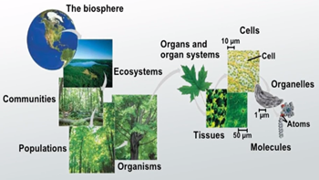
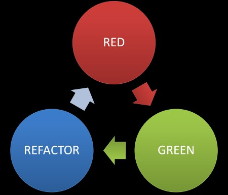

<style>
.font-red {
  color: red; 
}

.font-green {
  color: green; 
}
</style>

# <span class="font-green">Refactoring</span>

Mikhail Golubitsky  
Atlantis Technology  
June 2020  

<!--s-->

## <div class="font-green">Topics</div>

What is refactoring?

Why refactor?

Prerequisites for refactoring

Refactoring

<!--s-->

## <div class="font-green">Refactoring Résumé</div>

<!--v-->

### <div class="font-green">Energy Production API</div>

Extracted 3 <span class="font-red">copied-and-pasted</span> and <span class="font-red">untested</span> instances of an energy production algorithm

<!-- .element: class="fragment" -->

Established <span class="font-green">integration test harness</span> to generate fleet-wide estimates on-demand

<!-- .element: class="fragment" -->

Resulting REST API service had <span class="font-green">800+ unit tests</span>

<!-- .element: class="fragment" -->

Empowered team to <span class="font-green">deliver algorithm updates quickly</span>

<!-- .element: class="fragment" -->
Note: Used by sales, designers, reporting across all of Tesla Energy; v1 != v2 != v3, target changed to v4 (3/4 of the way through)

<!--v-->

### <div class="font-green">Other efforts</div>

<div class="fragment">A refactoring  <span class="font-red">failure</span></div>
<div class="fragment">Not enough understanding</div>
<div class="fragment">Tests were too few and too slow</div>
<div class="fragment">Too ambitious</div>
<div class="fragment font-green">...smaller, incremental refactors</div>

Note: 3 points climbing rule

<!--s-->

## <div class="font-green">What is refactoring?</div>

<!--v-->

> Refactoring is the process of restructuring existing computer code **without changing its external behavior**

--Wikipedia

<!--v-->

<span class="font-red">Not</span> refactoring:

<div class="fragment">New features</div>
<div class="fragment">Fixing bugs</div>
<div class="fragment">Optimization</div>
<div class="fragment">Introducing bugs</div>

<!--s-->

## <div class="font-green">Why refactor?</div>

<!--v-->

> Programs that are hard to read are hard to modify.

--Kent Beck

<!--v-->

<div class="fragment"><span class="font-green">Requirements change</span></div>
<div class="fragment"><span class="font-green">Understanding emerges</span> during programming</div>
<div class="fragment"><span class="font-red">Can't reason</span> about the program</div>
<div class="fragment">Can't separate <i>what</i> from <i>how</i></div>

<!--v-->

> Loss of the structure of code has a cumulative effect. The harder it is to see the design in the code, the harder it is to preserve it, and the more rapidly it decays.

--Martin Fowler, Refactoring

Notes: **Fowler:** The purpose of refactoring is to make the software easier to understand and modify.

<!--s-->

## <div class="font-green">Prerequisites for refactoring</div>

<!--v-->

### <div class="font-green">Understanding</div>

<!--v-->

> A program is a frozen representation of an idea, a snapshot of a structure that once existed in a programmer's imagination.

--Tom Stuart, Understanding Computation

Notes: There is a more ideal representation (program) of an idea.

<!--v-->

Understanding is <span class="font-green">emergent</span>

<!--v-->



<span class="font-green">Emergence</span>

Note: The arising of novel and coherent structures, patterns and properties during the process of self-organization in complex systems --Jeffrey Goldstein

<!--v-->

``` text
                 +------> Programming --------+
                 |                            |
                 |                            |
                 |                            v
Requirements --> Understanding    Understanding --> Software
                 ^                            |
                 |                            |
                 |                            |
                 +------- Refactoring <-------+
```

Understanding is an <span class="font-green">emergent opportunity to refactor</span>

<!--v-->

> I often refactor just when I'm reading some code. That way as I gain understanding about the program, I embed that understanding into the code for later so I don't forget what I learned.

--Martin Fowler, Refactoring

<!--v-->

### <div class="font-green">Tests</div>

<!--v-->

> Preserving existing behavior is one of the largest challenges in software development.

> Legacy code is simply code without tests.

--Michael Feathers, Working Effectively With Legacy Code

<!--v-->

#### <div class="font-green">Good tests are</div>

* Written first ([Uncle Bob explains why](https://www.youtube.com/watch?v=GvAzrC6-spQ))
* Fast (feedback)
* Independent (from one another)
* Repeatable (not flaky)

Note: The suite of tests is there so we are not afraid of our code. --Uncle Bob

<!--v-->

> What if you were a doctor and had a patient who demanded that you stop all the silly hand-washing in preparation for surgery because it was taking too much time?

--Robert C. Martin, Clean Code

<!--v-->



<!--s-->

## <div class="font-green">Refactoring</div>

<!--v-->

<div class="fragment">Write <span class="font-green">pure functions</span></div>
<div class="fragment">Name your functions well</div>
<div class="fragment">
Avoid <span class="font-red">state</span> and <span class="font-red">side effects</span>
</div>

<!--v-->

#### <div class="font-green">What are pure functions?</div>

<div class="fragment">Operate only on their arguments</div>
<div class="fragment font-green">Deterministic</div>
<div class="fragment font-green">Simple to reason about</div>
<div class="fragment font-green">Simple to test</div>
<div class="fragment font-green">Simple to maintain</div>
<div class="fragment">Business logic should be pure</div>

<!--v-->

#### <div class="font-green">How to name functions</div>

<div class="fragment">Reveal <span class="font-green">intent</span></div>
<div class="fragment">Nouns are for <span class="font-green">pure functions</span></div>
<div class="fragment">Verbs are for functions with side-effects</div>
<div class="fragment">Avoid <span class="font-red">disinformation</span></div>
<div class="fragment">Avoid <span class="font-red">mental translation</span></div>
<div class="fragment font-green">Consistency</div>

Notes: Consistency: within function, file, module, project, team, company -- in descending order of importance

<!--v-->

#### <div class="font-green">How to write functions</div>

<div class="fragment">Short</div>
<div class="fragment">One level of abstraction</div>
<div class="fragment">Low cognitive load</div>
<div class="fragment">Low <i>n</i> arguments</div>
<div class="fragment">No side effects!</div>
<div class="fragment">Okay fine, but certainly not in business logic</div>

Note: Uncle Bob: 1) Functions should do one thing. They should do it well. They should do it _only_. 2) Functions should either _do_ something or _answer_ something, but not both.

<!--v-->

Bigger refactorings <span class="font-green">emerge</span>

<!--v-->

> As the code gets clearer, I find I can see things about the design that I could not see before. Had I not changed the code, I probably never would have seen these things, because I'm just not clever enough to visualize all this in my head.

--Martin Fowler, Refactoring

<!--v-->

> The refactorings that have the greatest impact on the viability of the system are those motivated by new insights into the domain or those that clarify the model's expression through the code.

--Eric Evans, Domain-Driven Design

<!--s-->

> Perfection is achieved, not when there is nothing more to add, but when there is nothing left to take away.

--Antoine de Saint-Exupery

<!--s-->

<div class="font-green">Thank you!</div>
