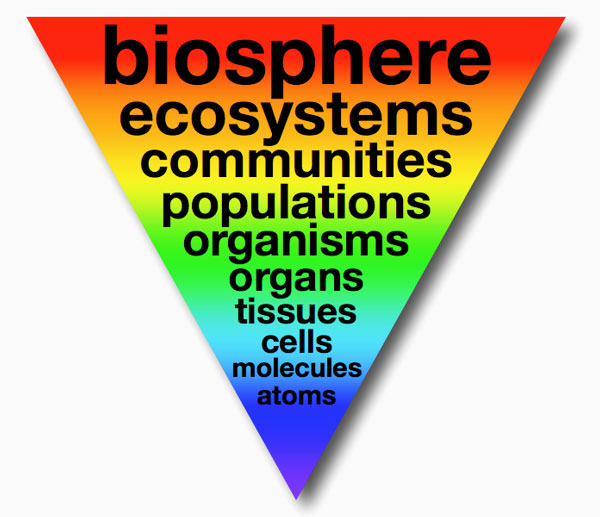

# <span class="font-green">Refactoring</span>

Mikhail Golubitsky  
Atlantis Technology  
June 2020  

<!--s-->

## Refactoring Résumé

<!--v-->

### Energy Production API

Extracted 3 <span class="font-red">copied-and-pasted</span> and <span class="font-red">untested</span> instances of an energy production algorithm

<!-- .element: class="fragment" -->

Established <span class="font-green">integration test harness</span> to generate fleet-wide estimates on-demand

<!-- .element: class="fragment" -->

Resulting REST API service had <span class="font-green">800+ unit tests</span>

<!-- .element: class="fragment" -->

Empowered team to <span class="font-green">deliver algorithm updates quickly</span>

<!-- .element: class="fragment" -->
Note: v1 != v2 != v3, target changed to v4 (3/4 of the way through)<br>

<!--v-->

### Other efforts

<!-- .element: class="fragment" -->

A refactoring  <span class="font-red">failure</span>.

<!-- .element: class="fragment" -->

No/few/expensive existing tests.

<!-- .element: class="fragment" -->

Too ambitious.

<!-- .element: class="fragment" -->

Not enough <span class="font-green">understanding</span>.

<!-- .element: class="fragment" -->

Smaller, incremental refactors throughout my programming career.

<!-- .element: class="fragment" -->

Note: 3 points climbing rule
<!--s-->

> A program is a frozen representation of an idea, a snapshot of a structure that once existed in a programmer's imagination.

--Tom Stuart, Understanding Computation

<!--s-->

## Emergence



Note: The arising of novel and coherent structures, patterns and properties during the process of self-organization in complex systems --Jeffrey Goldstein

<!--v-->

<!-- .element: class="fragment" -->

Understanding is <span class="font-green">emergent</span>.

<!-- .element: class="fragment" -->

Understanding is an <span class="font-green">opportunity to refactor</span>.

<!-- .element: class="fragment" -->

</div>

<!--s-->

## What is refactoring?

<!-- .element: class="fragment" -->

> The purpose of refactoring is to make the software easier to understand and modify.

<!-- .element: class="fragment" -->

> Refactoring does not change the observable behavior of the software.

<!-- .element: class="fragment" -->

<!--s-->

## Why refactor

> Programs that are hard to read are hard to modify.

--Kent Beck

> Loss of the structure of code has a cumulative effect. The harder it is to see the design in the code, the harder it is to preserve it, and the more rapidly it decays.

--Martin Fowler, Refactoring

<!-- .element: class="fragment" -->
<!--s-->

> I often refactor just when I'm reading some code. That way as I gain understanding about the program, I embed that understanding into the code for later so I don't forget what I learned.

--Martin Fowler, Refactoring

<!--s-->

> As the code gets clearer, I find I can see things about the design that I could not see before. Had I not changed the code, I probably never would have see these things, because I'm just not clever enough to visualize all this in my head.

--Martin Fowler, Refactoring

<!--s-->

## Always Be Refactoring

> Refactoring is not an activity you set aside time to do. Refactoring is something you do all the time in little bursts. You don't decide to refactor, you refactor because you want to do something else, and refactoring helps you do that other thing.

--Martin Fowler, Refactoring

<!--s-->

> Master programmers think of systems as stories to be told rather than programs to be written.

* Robert C. Martin, Clean Code

<!--s-->

## Functions

* Naming
* <span class="font-green">Pure</span> (avoid <span class="font-red">state</span>)  

<!--v-->

### How to name functions

Reveal intent

<!-- .element: class="fragment" -->

Nouns are for pure functions

<!-- .element: class="fragment" -->

Verbs are for functions with side-effects

<!-- .element: class="fragment" -->

Avoid disinformation

<!-- .element: class="fragment" -->

Avoid mental translation (cognitive load)

<!-- .element: class="fragment" -->

Consistency

<!-- .element: class="fragment" -->

Notes: Consistency: within function, file, module, project, team -- in descending order of importance

<!--v-->

### How to write functions

Short
<!-- .element: class="fragment" -->

One level of abstraction
<!-- .element: class="fragment" -->

_n_ arguments: 3+ is candidate for refactor

<!-- .element: class="fragment" -->

No side effects

<!-- .element: class="fragment" -->

Okay fine, but certainly not in business logic

<!-- .element: class="fragment" -->

Note: Uncle Bob: 1) Functions should do one thing. They should do it well. They should do it _only_. 2) Functions should either _do_ something or _answer_ something, but not both.
<!--s-->

> What if you were a doctor and had a patient who demanded that you stop all the silly hand-washing in preparation for surgery because it was taking too much time?

--Robert C. Martin, Clean Code

<!--s-->

> The proper use of comments is to compensate for our failure to express ourself in code.

* Robert C. Martin, Clean Code

Note: redundant, out of sync, opportunity to refactor

<!--s-->

> ... you find it hard to make changes your users want. This is where refactoring comes in.

--Martin Fowler, Refactoring

<!--s-->

## Single responsibility principle

> A class or module should have one, and only one, reason to change.

--Robert C. Martin, Clean Code

<!--s-->

* Run the tests.
* No duplication.
* Expresses intent.
* Minimizes amount of code.

<!--s-->

* Law of Demeter (for OOP)

``` ruby
announcement.event.gold.source.attribute['source_system_code']
```

* Opportunity for refactoring.

<!--s-->

Legacy Code - testing.

--Michael Feathers, Working Effectively With Legacy Code

<!--s-->

## Tests

* Fast
* Independent
* Repeatable
* Written <span class="font-green">first</span> ([Uncle Bob explains why](https://www.youtube.com/watch?v=GvAzrC6-spQ))

Note: The suite of code is there so we are not afraid of our code. --Uncle Bob
<!--s-->

Thank you!


