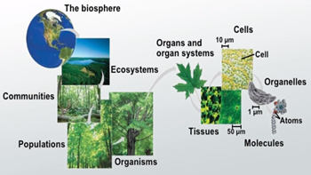

<style>
.font-red {
  color: red; 
}

.font-green {
  color: green; 
}
</style>

# <span class="font-green">Refactoring</span>

Mikhail Golubitsky  
Atlantis Technology  
June 2020  

<!--s-->

## Topics

What is refactoring?

Why refactor?

Prerequisites for refactoring

Refactoring tips

<!--s-->

## Refactoring Résumé

<!--v-->

### Energy Production API

Extracted 3 <span class="font-red">copied-and-pasted</span> and <span class="font-red">untested</span> instances of an energy production algorithm

<!-- .element: class="fragment" -->

Established <span class="font-green">integration test harness</span> to generate fleet-wide estimates on-demand

<!-- .element: class="fragment" -->

Resulting REST API service had <span class="font-green">800+ unit tests</span>

<!-- .element: class="fragment" -->

Empowered team to <span class="font-green">deliver algorithm updates quickly</span>

<!-- .element: class="fragment" -->
Note: Used by sales, designers, reporting across all of Tesla Energy; v1 != v2 != v3, target changed to v4 (3/4 of the way through)

<!--v-->

### Other efforts

<div class="fragment">A refactoring  <span class="font-red">failure</span></div>
<div class="fragment">Not enough understanding</div>
<div class="fragment">Tests were too few and too slow</div>
<div class="fragment">Too ambitious</div>
<div class="fragment font-green">...smaller, incremental refactors</div>

Note: 3 points climbing rule

<!--s-->

## What is refactoring?

> The process of restructuring existing computer code **without changing its external behavior**

--Wikipedia

<!--v-->

<span class="font-red">Not</span> refactoring:

<div class="fragment">New features</div>
<div class="fragment">Fixing bugs</div>
<div class="fragment">Optimization</div>

<!--s-->

## Why refactor?

<!--v-->

> Programs that are hard to read are hard to modify.

--Kent Beck

<!--v-->

## Why refactor?

<div class="fragment"><span class="font-green">Requirements change</span></div>
<div class="fragment"><span class="font-green">Understanding emerges</span> during programming</div>
<div class="fragment"><span class="font-red">Can't reason</span> about the program</div>

<!--v-->

> Loss of the structure of code has a cumulative effect. The harder it is to see the design in the code, the harder it is to preserve it, and the more rapidly it decays.

--Martin Fowler, Refactoring

Notes: **Fowler:** The purpose of refactoring is to make the software easier to understand and modify.

<!--s-->

## Prerequisites for refactoring

<!--v-->

### <div class="font-green">Understanding</div>

<!--v-->

> A program is a frozen representation of an idea, a snapshot of a structure that once existed in a programmer's imagination.

--Tom Stuart, Understanding Computation

Notes: There is a more ideal representation (program) of an idea.

<!--v-->

Understanding is <span class="font-green">emergent</span>

<!--v-->



<span class="font-green">Emergence</span>

Note: The arising of novel and coherent structures, patterns and properties during the process of self-organization in complex systems --Jeffrey Goldstein

<!--v-->

``` text
                 +------> Programming --------+
                 |                            |
                 |                            v
Requirements --> Understanding    Understanding --> Software
                 ^                            |
                 |                            |
                 |                            |
                 +------- Refactoring <-------+
```

Understanding is an <span class="font-green">emergent opportunity to refactor</span>

<!--v-->

> As the code gets clearer, I find I can see things about the design that I could not see before. Had I not changed the code, I probably never would have see these things, because I'm just not clever enough to visualize all this in my head.

--Martin Fowler, Refactoring

<!--v-->

### <div class="font-green">Tests</div>

<!--v-->

> Preserving existing behavior is one of the largest challenges in software development.

> Legacy code is simply code without tests.

--Michael Feathers, Working Effectively With Legacy Code

<!--v-->

#### Good tests are

* Written first! ([Uncle Bob explains why](https://www.youtube.com/watch?v=GvAzrC6-spQ))
* Fast (feedback)
* Independent (from one another)
* Repeatable (not flaky)

Note: The suite of tests is there so we are not afraid of our code. --Uncle Bob

<!--v-->

> What if you were a doctor and had a patient who demanded that you stop all the silly hand-washing in preparation for surgery because it was taking too much time?

--Robert C. Martin, Clean Code

<!--v-->

#### The Virtuous Cycle

TODO: graphic to show testing, understanding, programming

<!--s-->

## Refactoring tips

<!--v-->

<div class="fragment">Write <span class="font-green">pure functions</span></div>
<div class="fragment">Name your functions well</div>
<div class="fragment">
Avoid <span class="font-red">state</span> and <span class="font-red">side effects</span>
</div>

<!--v-->

#### What are pure functions?

<div class="fragment">Operate only on their arguments</div>
<div class="fragment font-green">Deterministic</div>
<div class="fragment font-green">Simple to reason about</div>
<div class="fragment font-green">Simple to test</div>
<div class="fragment font-green">Simple to maintain</div>
<div class="fragment">Business logic should be pure</div>

<!--v-->

#### How to name functions

<div class="fragment">Reveal <span class="font-green">intent</span></div>
<div class="fragment">Nouns are for <span class="font-green">pure functions</span></div>
<div class="fragment">Verbs are for functions with side-effects</div>
<div class="fragment">Avoid <span class="font-red">disinformation</span></div>
<div class="fragment">Avoid <span class="font-red">mental translation</span></div>
<div class="fragment font-green">Consistency</div>

Notes: Consistency: within function, file, module, project, team, company -- in descending order of importance

<!--v-->

#### How to write functions

<div class="fragment">Short</div>
<div class="fragment">One level of abstraction</div>
<div class="fragment">Low cognitive load</div>
<div class="fragment">Low <i>n</i> arguments</div>
<div class="fragment">No side effects!</div>
<div class="fragment">Okay fine, but certainly not in business logic</div>

Note: Uncle Bob: 1) Functions should do one thing. They should do it well. They should do it _only_. 2) Functions should either _do_ something or _answer_ something, but not both.

<!--v-->

> I often refactor just when I'm reading some code. That way as I gain understanding about the program, I embed that understanding into the code for later so I don't forget what I learned.

--Martin Fowler, Refactoring

<!--v-->

> Perfection is achieved, not when there is nothing more to add, but when there is nothing left to take away.

--Antoine de Saint-Exupery

<!--s-->
<div class="font-green">Thank you!</div>


